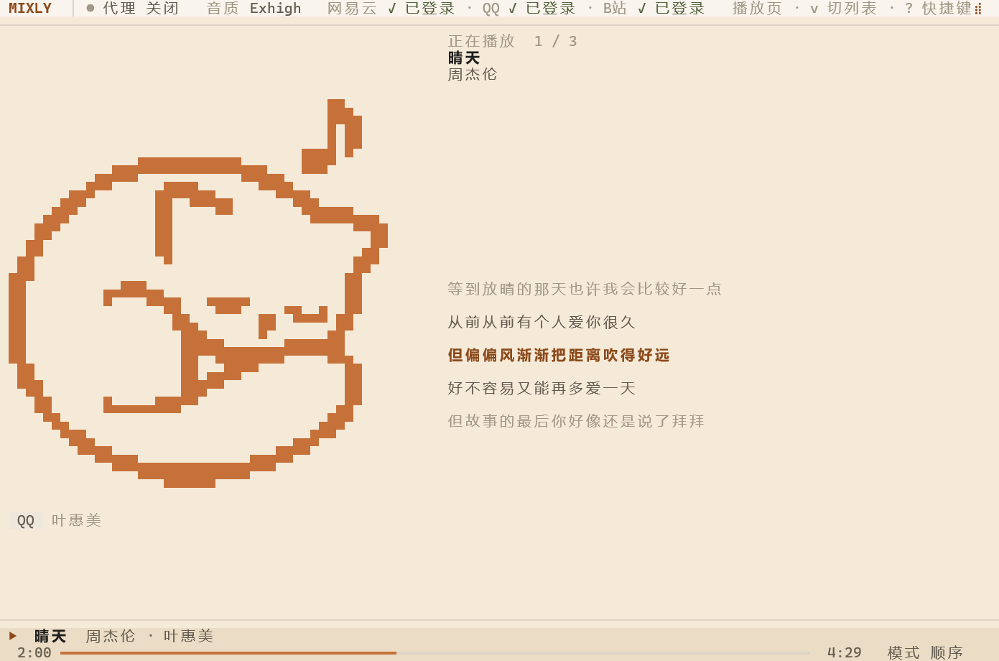
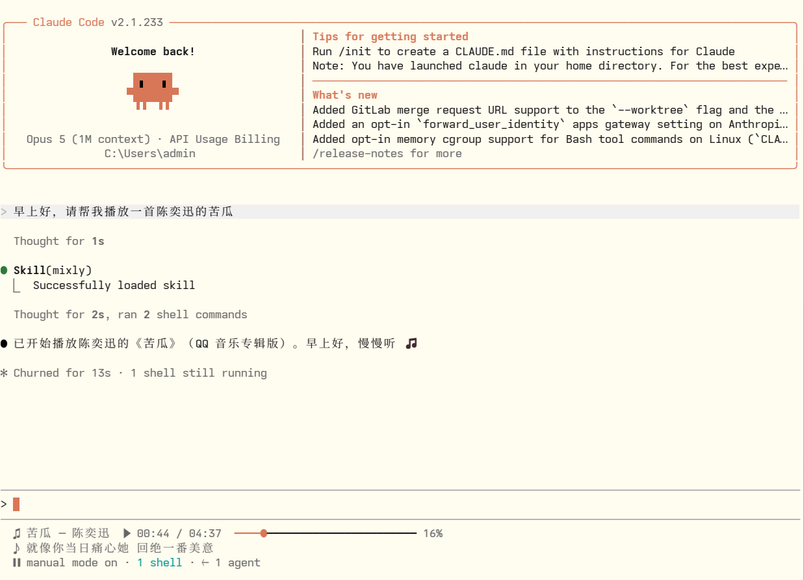

<p align="center">
  <picture>
    <source media="(prefers-color-scheme: dark)" srcset="assets/logo-dark.png">
    
  </picture>
</p>

<h1 align="center">mixly</h1>

<p align="center">Lightweight <strong>CLI / TUI</strong> music player written in Rust — drivable straight from a conversation.</p>

<p align="center">
  
  
</p>

<p align="center"><a href="README.md">简体中文</a> | <strong>English</strong></p>

## Preview

| TUI player | Claude Code plugin and status line |
|:---:|:---:|
|  |  |

## Features

- Netease Cloud Music + QQ Music + Bilibili video audio + local files, all mixable in one playlist
- Ships an agent skill, so once installed you **just tell the AI what to play** — no commands to memorize
- Claude Code status line with live song, progress and lyric
- High-quality streaming via external **mpv**
- Real proxy coverage for **API requests and audio streams** (local HTTP relay)

## Install (Windows x86_64)

**Tell Claude Code:**

> Install Mixly and the status line: https://github.com/Zyl0812/mixly

It reads this README and [`install.ps1`](install.ps1), runs the installer, installs the plugin, configures the status line, and prompts you to run `/reload-plugins`. Every step is idempotent, so rerunning is safe.

**Or run the commands yourself** (in order):

1. **Install mixly itself** (downloads `mixly.exe` and adds it to PATH)

   ```powershell
   irm https://raw.githubusercontent.com/Zyl0812/mixly/main/install.ps1 | iex
   ```

2. **Register the plugin marketplace** (the `@mixly` in step 3 refers to this source)

   ```powershell
   claude plugin marketplace add Zyl0812/mixly --scope user
   ```

3. **Install the Claude Code plugin** (the complete `mixly` skill plus the status-line `play` skill)

   ```powershell
   claude plugin install mixly@mixly --scope user
   ```

4. **Configure the status line** (writes `statusLine` into `~/.claude/settings.json`; only depends on step 1)

   ```powershell
   mixly statusline install
   ```

Then run `/reload-plugins` in the current Claude Code session. If you only want the status line and not the plugin, steps 1 and 4 are enough.

Codex / Grok users install the skill with `mixly skill install codex --global` (or `grok`) — see [Agent skill](#agent-skill).

## Usage

### Login

Log in first: without it QQ usually returns no stream URL, and Bilibili search is skipped. You always scan the QR code yourself — the agent only brings it up, never scans for you and never reads your tokens.

**Tell Claude Code:**

> Log me into QQ Music

**Or run the commands yourself:**

```bash
mixly login --platform qq                    # one platform per run: netease | qq | bilibili
mixly logout --platform bilibili             # deletes local credentials
```

### Play something

**Tell Claude Code:**

> Play 晴天 by Jay Chou
>
> I don't know what to listen to — play me something

**Or run the commands yourself:**

```bash
mixly search "海阔天空" --platform all
mixly play "晴天"                            # play by song name
mixly play qq <song_id>                      # exact: platform + id
mixly play bilibili BV1xx411c7mD             # BV id / av id / video URL
```

### Manage playlists

**Tell Claude Code:**

> Make a playlist called "test" and add these five Jay Chou songs
>
> Drop the third track from the test playlist, then shuffle it

**Or run the commands yourself:**

```bash
mixly playlist create "test"
mixly playlist add "test" qq <id> --name "晴天" --artist "周杰伦"
mixly playlist show "test"                   # shows indices, 0-based
mixly playlist remove "test" 2
mixly playlist move "test" 2 0
mixly playlist play "test" --random --loop
mixly playlist list                          # also: rename / delete
```

### Import local music

**Tell Claude Code:**

> Import the music folder on my D: drive

**Or run the commands yourself:**

```bash
mixly local import D:\Music --playlist "Local"
mixly local list
mixly local remove <path>                    # removes from the library, not from disk
```

### Preferred search platform

```bash
mixly config prefer netease                  # persisted, defaults to qq
mixly --prefer qq search "晴天"               # this run only
mixly config show
```

### Playback status line

`mixly play` writes the current song, position, pause state and lyric to `%APPDATA%\mixly\now-playing.json` every 400ms; the Claude Code status line reads it once per second and costs no model tokens.

```bash
mixly status --json      # machine-readable state (empty when nothing is playing)
mixly status --claude    # render the Claude Code status line
mixly statusline install # install / repair the status line on its own
```

If a `statusLine` already exists, the installer prepends `mixly status --claude`: playback on top, the original output below. The original object is backed up to `~/.claude/mixly-statusline-backup.json` and restored exactly on uninstall; a later-edited config is protected by default, and `--force` strips only the Mixly prefix.

### TUI

```bash
mixly tui
```

| Key | Action |
|---|---|
| `j` / `k` | Move |
| `Enter` | Play selection |
| `Space` | Pause / resume |
| `n` / `p` | Next / previous |
| `/` | Search |
| `a` | Add search hit to playlist |
| `+` / `-` | Volume |
| `h` / `l` | Seek ±5s |
| `m` | Cycle play mode |
| `q` | Quit |

## Agent skill

mixly ships [`skills/mixly/SKILL.md`](skills/mixly/SKILL.md), embedded in `mixly.exe`. Drop it into an AI coding agent and you get the conversational usage shown above — the agent runs the same `mixly` commands under the hood and never touches mixly's source.

```powershell
mixly skill install claude --global               # or codex / grok; user directory, all projects
mixly skill install claude --project              # current directory only
mixly skill path codex --global
mixly skill uninstall codex --global
```

Claude Code users can just use the public marketplace from [Install](#install-windows-x86_64) above (it installs both the complete `mixly` skill and the status-line `play` skill); `mixly skill install claude --global` is the local install of the embedded plugin. **Pick one** — do not install both `mixly@mixly` and `mixly@mixly-local`.

Install and uninstall refuse to replace a modified file; pass `--force` only when you intend to overwrite or remove it. Restart the agent if it does not detect the new skill.

The skill spells out the guardrails, so the agent won't make a mess:

- CLI only — it never launches `mixly tui` (the interactive UI would block it)
- Playback is always backgrounded — no waiting out a whole song in the foreground, and never two `play` commands at once (they'd fight over mpv's IPC pipe)
- Login requires *you* to scan the QR code; the agent won't pretend it's signed in, and never pastes token contents into the conversation
- Has a recovery path for the usual failures: empty stream URL → tells you to `login` or switches platform; no search hits → suggests `--proxy` or a shorter query; mpv errors → tells you to install mpv

## Configuration

Config directory (via `directories` crate):

| OS | Path |
|---|---|
| Windows | `%APPDATA%\mixly\` |
| Linux | `~/.config/mixly/` |
| macOS | `~/Library/Application Support/mixly/` |

`config.toml` example:

```toml
[general]
quality = "Exhigh"          # Standard | Higher | Exhigh | Lossless
preferred_platform = "qq"   # qq | netease | bilibili

[proxy]
enabled = false
url = "socks5://127.0.0.1:7890"

[player]
mpv_path = "mpv"
```

Tokens are stored separately as `netease_token.json` / `qq_token.json` / `bilibili_token.json` (Bilibili stores only minimal Cookie fields). The playback snapshot lives in `now-playing.json` and contains no tokens or URLs.

## Bilibili notes and limits

- Plays **audio from ordinary UGC videos only** (DASH audio stream): no video track, no download, no transcode, no export.
- Login is always QR with your own account; credentials stay local and never hit logs.
- Unsupported: Bangumi/PGC, courses, paid content, live streams; no bypassing of VIP/region/DRM limits; Dolby/Hi-Res tracks; auto-renewal (re-scan QR when expired).
- Picks the highest ordinary audio bandwidth your account is allowed, with no quality-tier mapping; tracks are never fully prefetched — streaming with Range only.
- The web API integration is experimental and may break as the platform changes; failures only affect Bilibili, not Netease/QQ/local.

## Proxy

**Tell Claude Code:**

> Search 海阔天空 through the socks5://127.0.0.1:7890 proxy

**Or run the command yourself:**

```bash
mixly --proxy socks5://127.0.0.1:7890 search "海阔天空"
```

For a persistent setting, write it into `[proxy]` in `config.toml` (see [Configuration](#configuration)) — you can also just ask Claude Code to edit that file.

Priority: `--proxy` > `config.toml [proxy]` > `ALL_PROXY`/`HTTPS_PROXY`/`HTTP_PROXY` > direct.

Audio always goes through mixly's local relay (`127.0.0.1:<ephemeral>/current`), so SOCKS5 and HTTPS CDN work even when mpv/FFmpeg cannot use SOCKS. The API clients and audio relay use the same resolved proxy.

## License

MIT (see `license` in [Cargo.toml](Cargo.toml)).
